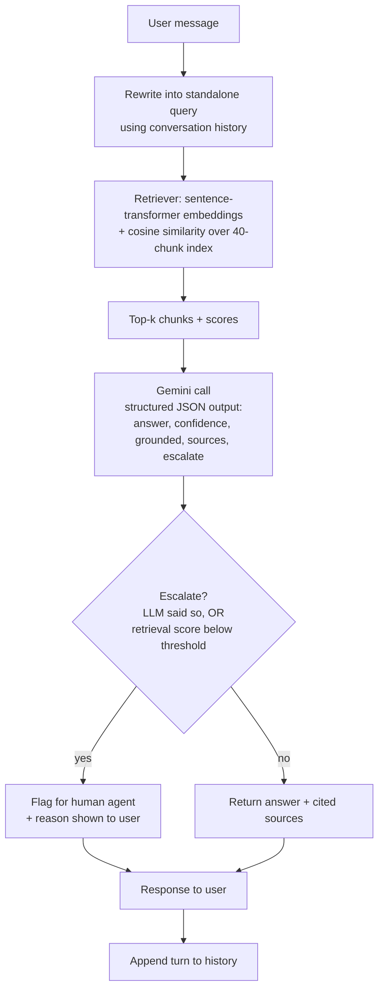

# System Design

## Query flow

## Components

| Component | File | Responsibility |
|---|---|---|
| Ingestion | `src/ingest.py` | Parse markdown -> `Chunk` records |
| Retriever | `src/retriever.py` | Build/query the embedding index (sentence-transformers + cosine similarity) |
| LLM client | `src/llm.py` | Query rewriting + grounded generation (Gemini) |
| Pipeline | `src/pipeline.py` | Retrieve -> generate -> escalation decision |
| CLI | `src/chat.py` | Multi-turn conversation loop |
| Eval | `eval/run_eval.py` | Retrieval hit-rate + escalation accuracy checks |

## Out of scope for this prototype

- Persistent conversation storage (history is in-memory for the session)
- Real vector DB at production scale (brute-force cosine similarity over
  ~40 chunks instead — see `docs/data_schema.md` for the FAISS/pgvector
  mapping once the corpus is much larger)
- Human-agent handoff integration (escalation is a flag in the CLI output, not routed anywhere)
